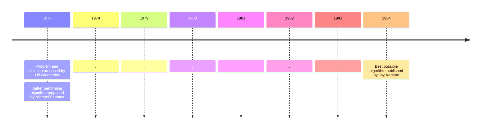

A little feed for thought or at least a fun fact:

### Timeline of solving the [maximum subarray problem](https://en.wikipedia.org/wiki/Maximum_subarray_problem)

$$
\\begin{gather*}
\\text{Given an array of numbers $\\;A[1..n]$, find}
\\newline
\\displaystyle \\max\\left\\{\\sum_{i=k}^m A[i]:\\quad 1\\le k\\le m\\le n\\right\\}
\\end{gather*}
$$




| Author | Occupation | Figured out the solution... | Time complexity |
|-|-|-|-|
| Grenander | mathematician, statistician, professor | | $O(n^2)$ |
| Shamos  | comp-scientist, mathematician, professor | overnight | $O(n\\;\\log\\;n)$ |
| Kadane  | statistician, professor | in a minute | $O(n)$ |

The $O(n)$ algorithm:

```python
def max_subarray(arr):
    best = float('-inf')
    current = 0
    for num in arr:
        current = max(num, current + num)
        best = max(best, current)
    return best
```

Obvious, right?
